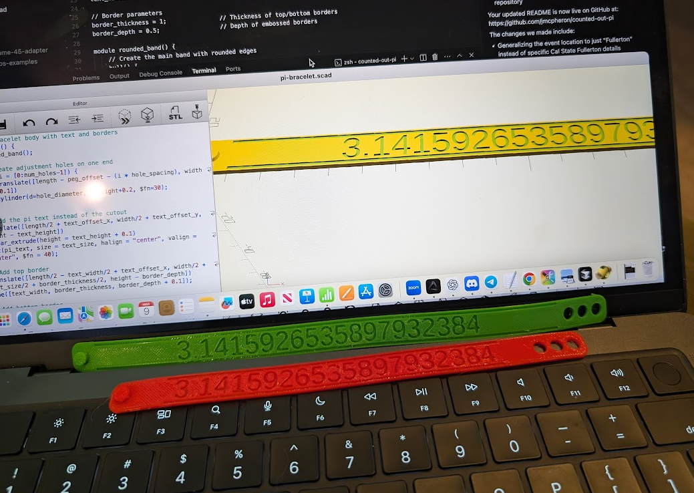

# Counted Out Pi: Mathematical Wearables 🧮π

Express your love for mathematics with this flexible 3D printed bracelet! Designed specifically for the "Counted Out" film screening event in Fullerton on Pi Day, this TPU bracelet combines style with mathematical significance.

## 3D Printed Prototypes

Check out our latest 3D printed prototypes! These designs showcase the flexibility and wearability of our mathematical bracelets.

## Quick Start

1. Download the STL file from the `models` directory
2. Print with TPU filament (95A flexibility recommended)
3. Wear your mathematical pride on your wrist!

## Repository Contents

- `src/` - OpenSCAD source files for customization
  - `pi-bracelet.scad` - Main Pi bracelet design
  - `spacer-42.scad`, `spacer-128.scad`, `spacer-254.scad` - Mathematical spacer designs
- `models/` - Ready-to-print 3D model files (STL)
  - `pi-bracelet.stl` - Main Pi bracelet model
  - `spacer-42.stl`, `spacer-128.stl`, `spacer-254.stl` - Mathematical spacer models
- `images/` - Photos and renders of the bracelets

## Bracelet Spacers

In addition to the main Pi bracelet, this repository includes designs for mathematical spacers that can be used to create custom bracelets:

- **Spacer-42**: The Answer to the Ultimate Question of Life, the Universe, and Everything
- **Spacer-128**: A power of 2 (2^7) commonly used in computing
- **Spacer-254**: One less than the maximum value of an 8-bit unsigned integer (2^8-2)

These spacers can be mixed and matched to create personalized mathematical bracelets.

## Printing Tips

TPU (Thermoplastic Polyurethane) is a flexible filament that creates comfortable, wearable prints:

- Print slowly (20-30mm/s recommended)
- Use direct drive extruder if possible
- Minimal retraction settings
- No cooling fan or minimal cooling
- Bed temperature: 40-60°C
- Nozzle temperature: 220-235°C

## About the Event

This bracelet was created for the "Counted Out" film screening in Fullerton on Pi Day, March 14. The event is part of the global Pi Day celebrations.

### Event Details:
- **Date:** March 14 (Pi Day)
- **Format:** Film screening followed by a discussion panel

This screening is one of 314 showings of "Counted Out" happening globally throughout March in celebration of Pi Day. The award-winning documentary explores the role of mathematics education in addressing societal inequities through personal stories, expert interviews, and examples of mathematical transformations.

The film honors Bob Moses, the civil rights icon who developed The Algebra Project to address the lack of access to rigorous mathematics learning in urban and rural schools.

## License

This project is released under the [Creative Commons Attribution 4.0 International License](https://creativecommons.org/licenses/by/4.0/).

## Credits

Designed by [Jason McPheron] ([@jmcpheron](https://github.com/jmcpheron))

---

*Where mathematics meets wearable art!* 